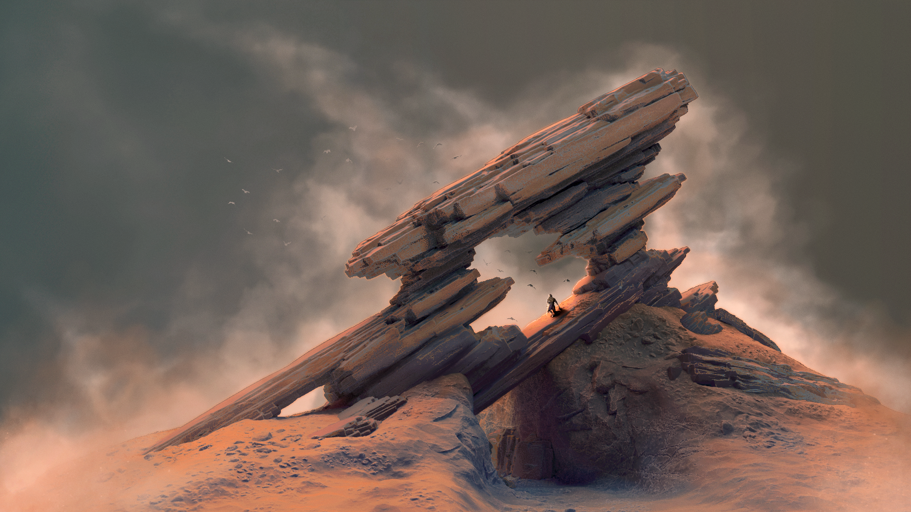

# Rust Roguelike

This Rust Roguelike is a Roguelike written in Rust. It is a Roguelike with a
focus on movement, use of space, stealth, and some resource management. 
It has themes of deserts, ancient ruins, mechanisms, and the sun.


Some unusual aspects that make this game interesting:

    * Intertile walls- walls that are between two tiles instead of within a tile
    * A varied movement system which allows slow sneaking movement, normal walking, and running,
    each with different levels of visibility, levels of noise, movement distance, and capabilities (such as
    jumping over short walls while running).
    * A stealth system based on noise level and visiblilty, with various factors effecting LoS.
    * Unusual classes like 'clockwork', 'monolith', 'grass', or 'heirophant' with their own unique skills.
    * A control scheme designed around simplicity and immediacy, while also providing a high level of
      information to the player to allow careful consideration of their moves.


This game is in development. It is not in a playable state- if you run the game you will be able
to play through levels by finding the goal object, picking it up, and carrying it to the exit,
but there is no larger goal or game beyond this.



## Building

This is tested on Windows and Linux. On Linux (and likely on a Mac, although
this is untested), make sure SDL2 is installed including SDL_ttf and SDL_image.
On Windows the repository contains the necessary SDL2 files so no installation is
required.

Then just run:
```bash
cargo run
```
which will download all dependencies and get it running. If you are playing and not developing,
consider
```bash
cargo run --release
```
to get a smoother experience, but note that it will take some time the first time it is
run (several minutes).

## Gameplay

### Key Map

There are three gameplay modes: cursor mode, direct mode, and use mode.


Direct mode is the usual input mode- the movement keys move the player. In
this mode the player can run, walk, and sneak.

Cursor mode is entered using the 'space' key. In cursor mode the movement keys
move a cursor around the map. This cursor can be used to inspect tiles, use skills,
and throw items. Throwing items is accomplished by holding 'alt' and pressing the 
item's key.


Use mode is entered by pressing an item's key. Once in use mode the player can
move to any of the highlighted tiles. Each item provides different movements, and
there may be no tiles available until the player is in a particular situation.

#### Movement

Move with the number keys. The arrow keys also work, but do not allow diagonal movement.
Normal movement leaves the player in the standing stance.

The number '5' key passes your turn.

If shift is held when moving, you will run in the target direction. Running makes additional
noise, but moves two tiles. Once the player runs they are in the running stance.

If ctrl is held when moving, you will sneak in the target direction. Sneaking
makes less noise then other movements, and leaves the player in the crouching stance.


#### Stances

The player can either be in the crouching, standing, or running stance. If the player
is crouching then they cannot be seen over intertile walls, but they also cannot see
over itertile walls. Items may be effected by stance, such as the dagger which
can only be used while crouching.

Standing and running both allow line of sight over intertile walls. If you
are crouching and want to stand, pass your turn without holding ctrl.
If you are standing or running and want to crouch, pass your turn while
holding ctrl.


#### Items

Items are mapped to 'z' (first item), 'x' (second item), and 'c' (third item).
When an item is used, you may enter use mode. See the documentation above
for information on modes.

Items can be thrown by holding alt and pressing their key while in cursor
mode. This throws them towards the cursor's location.

Items can be picked up with the 'g' key (to 'get' the item).

Items can be dropped by throwing them on the same tile that the player is on,
or using them in the '5' direction (the 'pass turn' key).


#### Skills

Skills are mapped to 'a' (first skill), 's' (second skill), and 'd' (third skill).
Skills can be used by pressing their key in cursor mode.

Currently the classes are selected by pressing 'h', although this is more of
a development system then the final concept. You may select a class from a list
using the number keys. Pressing 'h' again will allow you to change classes.

Once a class is selected, press 'j' to see a list of skills. The skills are mapped
to 'a', 's', and 'd' in the order that they are shown in the list.

The classes are roughly as follows:

    * Grass is about stealth and hiding. It allows you to lay down grass which reduces
      noise, to step quietly using shoes made of grass, and to attack stealily with grass daggers.
      The Grass class' resource is grass tiles.
    * Monolith is about stone. It allows crushing and reconstructing walls,
      and passing through walls. The Monolith class' resource is walls and rubble.
    * Clockwork is about power and mechanism. It allows you to punch a golem with
      a power first, pushing them back.
    * Hierophant is about sight and health. It allows you to view hidden tiles,
      extend your field of view, and heal your health.

#### Menus

There are several menus that help you understand the game or select options.

The 'h' key opens the class menu, allowing you to select a class.

The 'j' key opens the skill menu, listing your current skills. 

The 'i' key opens the inventory menu, listing your current items. 

The 'q' key opens a menu asking if you would like to quit. Pressing 'q' again will
quit the game.

The 'esc' key can be used to exit a menu.


#### Other

Holding alt and pressing a directional key will 'interact' with the tile in that direction,
such as to disarm or arm a trap.

The 'o' key shows an information overlay while it is held. This shows golem Fov, attack positions,
and other information.

The 'y' will cause your character to yell, making noise.

The 'q' key will prompt to exit the game, and pressing 'q' again will exit.

The 't' key is a debugging key which makes you invincible and shows you the map. It
can be pressed again to hide the map.

The 'p' key is a debugging key which regenerates a new level.

The '[' and ']' keys are using to rewind and replay turns as a debugging aid.
See the section on rewinding time for details.


### Sound

The game has a sound system in which different actions make different amounts of
sound. The golems may hear a sound and investigate its source, possibly causing them
to discover the player. Actions like running or yelling make a lot of sound, while
sneaking and using most skills make little to no sound.

Some skills effect the amount of sound movement takes, and the surface of a tile
can dampen sounds (grass), or make them louder (rubble).

Before taking an action, consider the noise it will make. Golems are formitable
opponents and alterting them to your presence is usually quite dangerous.
Sound can also be used to your advantage such as when throwing a stone or
other item to lead a golem away from a position.


### Traps

The game contains traps of various types. Walking on a trap triggers it if the 
trap is armed. Traps can be disarmed by interacting with them, and then armed
again by interacting again.

A disarmed trap can be picked up, allowing the player to carry traps around and
place and rearm them.


### Triggers

In addition to traps, there are stationary triggers which cannot be disarmed or
picked up. These will raise or lower a wall when stepped on, and will raise
or lower the wall again if stepped off and then stepped on again.


## Architecture

The overall architecture of the game is something like this: there is a
series of layers to the game, each of which builds on the layers below.
These layers are the core code (roguelike_core) which includes AI, the
map data structure and algorithms, the basic types, the messages that
effect gameplay, and more.

Above the core code is the engine (roguelike_engine). This includes input events,
translation into messages, and message processing, as well as the 'step' function
that steps the game logic forward one turn.

Above the engine is the user interface. In the tile version of the game this
is an SDL2 system which receives input, draws to the screen, and handles loading
resources at startup.


This layering is the static architecture of the code. The dynamic architecture 
(meaning, what happens when the game is running), starts with input events
from SDL2, which are, and translated into an internal InputEvent
structure (keypresses, mouse movement, etc) for processing.

This input event is translated into an action (InputAction) that describes what
the input does in the game's current state (without changing its state).
This translation is internal to the game, and uses the game's state.

This input action is provided to the step\_game function of the cleverly named
Game structure.  

The step\_game function dispatches through the game's current state- playing,
in a menu, etc. This can change the state of the game, and any settings
(GameSettings), but does not modify the game's data (GameData). It can only place
messages in the message queue that is used to execute a turn of the game.


Once the state system has created its messages, and optionally
changed its state, the resolution system starts.  This executes each message- 
using an item, moving, using a skill, etc, which may in turn spawn more
messages- until there are no more messages to process.

Message processing may set the took\_turn flag for an entitity, and if the
player is marked as having taken a turn then the other entities in the game get
a chance to spawn messages. These messages are themselves resolved until
no messages are left.

This is the only place where game actions occur- there are places that generate
maps or do other modifications, but each turn is entirely handled as a sequence
of messages resolved in order.


### Types

The main structures are: 

    * Game: this structure holds the GameData, as well as settings, configuration, logging, random
    number generation- generally data needed to run the game but not necessarily within the game world.
        * GameData: this structure is simply an Entities and a Map. It is the core structure of the game,
            holding the entire game world and all its entities. This structure provides some functions such
            as FOV which take into account both the map and the entities, where the lower level functions
            can't use both types of information.
            * Entities: this structure contains all components, and a vector of ids which identify
            each entity. The id can be used to index a component to get that entities data if it exists.
            * Map: this is a grid of Tile structures, with information on blocking movement, sight, the
            types of surfaces, etc. This structure has many functions for FOV, pathing, floodfill, and others.
        * Config: the game's static configuration, read from config.yaml.
        * MsgLog: the message log is used to both print a console log for the user (classic Roguelike style),
        as well as to drive the game's logic. The messages are processed by the game engine to change game
        state, as well as provided to the display system to change the display state.
    * InputAction: the input actions are all actions that the player can perform, including navigating menus
    or quitting the game.
    * Msg: the messages put in the message log. This contains all changes that can occur to the game state, 
      including movements, attacks, triggering traps, using skills, and starting and ending a turn.
    * Input: the state of the input system. This type contains information on modifier keys and which other
      keys are held, and uses this information to map key presses into inputs to the game.
    * Display: the display state contains SDL2 types, loaded textures, sprite and animation information, as well
      as screen layout. It is used in render the game to the screen.


There are a number of ancillary structures such as Vaults for parts of maps, GameSettings for mutable data like
the current turn or whether the overlay is on, ProcCmd for controlling level generation, and others.


### Design

There are some design considerations that have a sigificant effect on the game's code. One is that no
part of the codebase keeps links to other parts- it is all a single big data structure (Game), which is
taken apart and passed to functions to mutate it and have side effects. This keeps changes to state
in constrained locations, which helps with finding the location and sequence of state changes.


In addition, many components do not make changes themselves, but emit structures that are then processed.
This allows things like recording actions, and testing components. A good example is the input system
processing inputs to game actions, then to messages, and then finally to changes to the game's state.


The game is also split into layered crates within a workspace, such that the roguelike\_core knows
about the core types, but not how the game is displayed or how maps are generated (for example),
while roguelike\_engine knows about actions, procedural generation, and handling inputs, but not
displaying or the main loop.


Finally roguelike\_main is the main loop, as well as the SDL2 display system.
This is split into display data with the animations, textures, screen layout,
etc, and then a rendering function which does all the drawing to the screen
using the display data and game's state (Game).


This split allows roguelike\_lib to compile a binary that is separate from SDL2
and can be integrated into other systems like Unity, or wrapped in TCL to
run in scripts.


### Interesting Internal Features

There are a number of interesting features that are not necessarily visible
when playing the game.


#### Action Logs and Replay

The game records a list of actions taken by the player, which can be replayed for
debugging. This allows bugs to be captured in a log and sent to be debugged, and to
view replays of games.


#### Winding and Rewinding Time

The game has a simple "undo/redo" system, implemented by copying the game state
each time an action is taken. This is not part of the gameplay, but rather a
debugging tool.


These states are kept in a stack, and can be popped off with the '[' key. In
addition to the game's state, the action that caused a transition between game
states is stored, so that when the ']' key is pressed that action is replayed,
allowing both forward and backwards movement.


One interesting nuance here is that you can rewind the game, take a different
action, and then replay your old actions on top of the new game. This allows
debugging certain situations where one path causes a problem and another does
not (like using an item before making a move).


#### Command Line Interpreter and rl_engine

The game has a simple command line interface defined in commands.rs. When
compiling the 'engine' version of the game (the one used when running within
Unity), this is the only interface, while in the SDL2 version of the game this
interface is available in addition to the game GUI.


This interface exposes simple commands to list ids, query the map, change
entity states, add entities, etc. This can be driven by other programs such as
TCL or Unity. The commands print out results in a simple text format that must
be parsed by the calling program. All interaction takes place using stdin and
stdout.


The rl\_engine version of the game runs exactly as the SDL2 version internally-
the logic is driven by the same input events. The difference is only in the
source of those events, and the lack of a UI when running the engine.


#### Performance Monitoring

The game generates performance logs as game.log. These contain some basic
'spans' such as the time taken for logic, display, waiting for a new frame to
start, etc. Additional timers can be added to get more detail.


A pyimgui tool called analyzer.py can visualize these traces and plot them for
analysis.

#### System Level Testing

In addition to the usual unit tests, which can be run with 'cargo test', the
game has system level tests. These tests are created by starting the game
with certain flags that cause it to record the player input and its result.

Once a test has been recorded, it can be replayed to check that it matches the
original play through. This allows testing of the full game, end to end, and
to check that certain changes do not effect game play (such as performance improvements
that are not intended to be visible to the player).

The play throughs can be tested individually or can be run all togther. The latter
creates a system level checkout. When checking a playthrough, the game will report
whether there are new messages, missing messages, or a mismatch of messages.
This is helpful in cases where the playthrough is identical, but there are simply
new things being reported that do not effect the results.

As the game is modified, these play throughs will become out of date due to 
valid changes. To mitigate this situation, which in general requires the user
to redo all the broken play throughs each time they change, there is an option
to replay all or one of the recorded games and accept the new results as the
'golden record', replacing the original playthrough.


#### Map Density Heatmap

The game generates a file called map_emptiness_distribution.txt which contains
distribution of how densely populated the map is. This can be turned in to a
heatmap with 'map_distribution.tcl'.  This information is used for guiding
procgen to make sure the maps are not to spare or too dense.

The map is generated using a floodfill algorithm and counting, for each tile,
how many other tile's flood fill reach that tile.


#### Wave Function Collapse (WFC)

The game uses the WFC algorithm internally for map generation. The resources
directory contains some wfc_seed_*.png files. These images contain pixels used
as input to the map generation algorithm.


#### Symmetric Shadowcasting

The Line of Sight (LoS) algorithm used in this game uses the symmetric shadowcasting algoritm.
This is a very nice algorithm for LoS on a grid, and was adapted from a Python version
and turned into a separate Rust crate for use in this game.


#### Vaults

The game makes use of 'vault' files found in resources/vaults. These files
contains small maps in a text format with interesting formations of entities
and tiles. These are stamped into the map during procgen to create structured
areas within the otherwise randomly generated maps.


The format of the vaults requires twice the number of character as the number
of tiles in the resulting map. This allows even tiles to indicate the contents
of a tile, and odd tiles the intertile walls.


#### Map Generation

The map generation algorithm uses the WFC algorithm mentioned above, and detects
structures created by the image that the algorithm outputs. It turns these
structures into walls of different types, and uses a configuration file to
determine which items/golems/traps/triggers to generate and in what general
frequency.

It also uses the map density information mentioned above to lay down
grass in oppertune locations.

